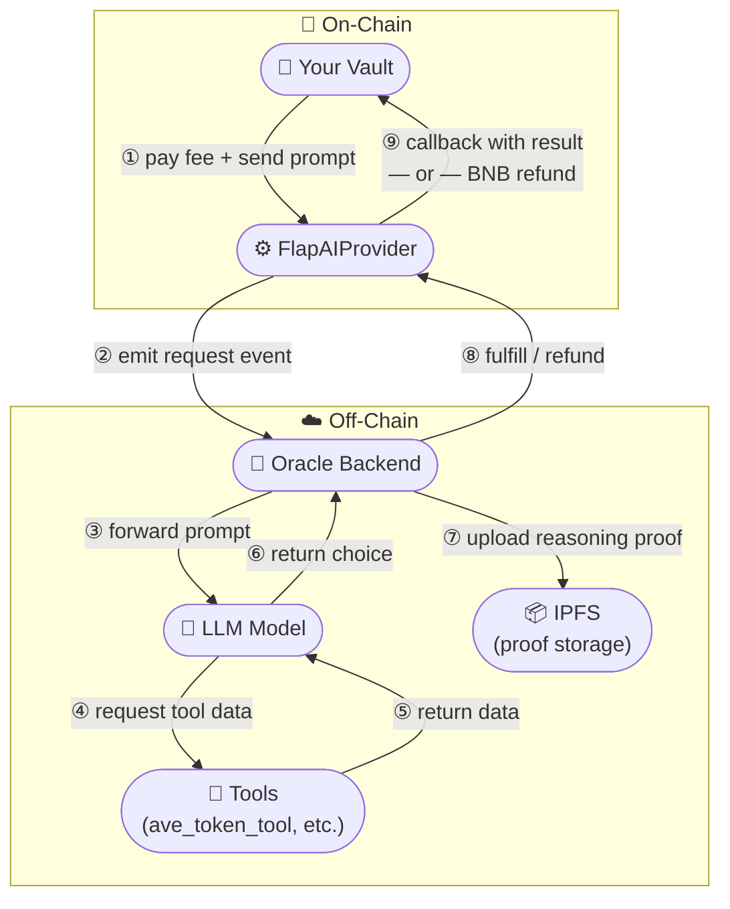
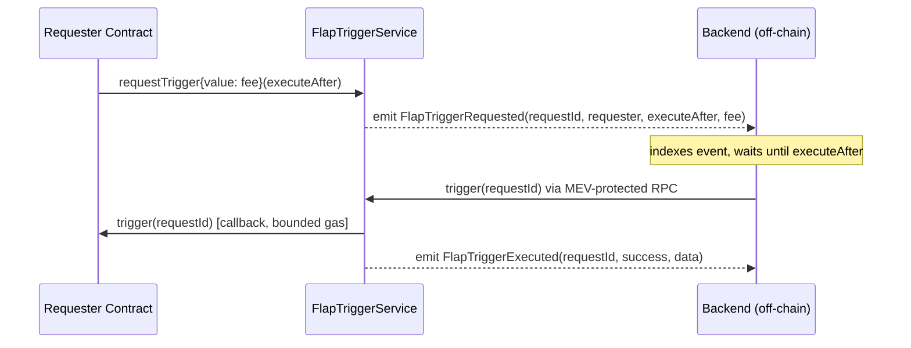

# Brief Overview of Flap

<figure><figcaption></figcaption></figure>

Flap is the infrastructure layer for programmable token launches on EVM chains. Currently live on **BNB Chain, Monad, X Layer, and Morph**, with more EVM chains coming.

Flap gives builders a modular framework to launch tokens that don't die after launch — with customizable bonding curves, programmable tax distribution, on-chain AI-powered vaults, and V4 hook fee routing, all in one place. From meme tokens to sophisticated DeFi primitives, Flap makes it easy to deploy, scale, and innovate.

**For token creators**, Flap supports a growing family of token standards — Tax Token V3, V4 Hook (zero-tax with LP fee routing), Gift Vault, NFT Vault, and more — each with customizable post-launch mechanics. Tokens launched on Flap automatically appear across major wallets, terminals, and discovery platforms in the ecosystem.

**For Vault developers**, Flap provides an open Vault Specification. Build and deploy your own Vault Factory templates without permission — and earn protocol-enforced commission every time a token uses your template, for the entire lifetime of the tax. Verified factories receive a risk-level badge displayed across all surfaces.

**For AI builders**, Flap AI Oracle gives any smart contract verifiable access to LLM reasoning (Claude, Gemini, DeepSeek) — every decision is permanently provable via IPFS.

Backed by YZi Labs and built for the next generation of token economies.

---

# OpenClaw Skills

Flap's published skills are available on the ClawHub registry. You can invoke them directly from any OpenClaw-compatible agent.

---

## Launch a BNB Token on Flap

**Registry page:** [clawhub.ai/flapguy/launch-bnb-token-on-flap](https://clawhub.ai/flapguy/launch-bnb-token-on-flap)

This skill walks an AI assistant through every step required to launch a token on Flap (BNB Chain): uploading metadata to IPFS, mining a vanity salt, encoding calldata, and broadcasting the transaction.

### How to use

Give your OpenClaw-enabled assistant a prompt like one of the examples below. The skill handles the rest.

---

### Example 1 — Tax token gifted to an X account (Gift Vault)

Launch a tax token whose trading fees are gifted to the X account `@elonmusk` using the **Gift Vault**. No vault factory address is needed — just refer to it by name.

```
Launch a tax token on Flap BNB called "Elon's Rocket" with symbol ROKYT.
Use the Gift Vault and set the gift owner to the X account @elonmusk.
Set buy tax and sell tax both to 5%.
Spend 0.00001 BNB on the initial buy.
```

---

### Example 2 — Tax token with a custom vault factory

Launch a tax token and route its fees through a specific vault factory you have already deployed.

```
Launch a tax token on Flap BNB called "Alpha Fund" with symbol ALFX.
Use the vault factory at address 0xAbCd1234AbCd1234AbCd1234AbCd1234AbCd1234 to set up the vault.
Set buy tax to 3% and sell tax to 3%.
Skip the initial buy.
```

---

### Example 3 — Tax token without a vault

Launch a straightforward tax token with no vault. Fees go directly to a beneficiary address.

```
Launch a tax token on Flap BNB called "Simple Tax" with symbol SMTX.
No vault. Set buy tax to 0% and sell tax to 3%.
Set the beneficiary to 0xYourBeneficiaryAddressHere.
Spend 0.05 BNB on the initial buy.
```

---

### Example 4 — Non-tax token

Launch a basic token with no taxes at all. This is the simplest type of token.

```
Launch a non-tax token on Flap BNB called "Pure Coin" with symbol PURE.
Spend 0.01 BNB on the initial buy.
```

---

# Flap AI Oracle

## 1. Overview & Roadmap

### Overview

Three simple steps — build your prompt on-chain, let us handle the AI, and get back a verified decision.

**FlapAIProvider** is a standardized on-chain AI oracle plugin built for the Flap ecosystem. It gives Vault contracts (and any smart contract) access to verifiable LLM reasoning via a **commit-and-reveal** scheme inspired by Chainlink VRF.

FlapAIProvider separates concerns of AI-powered smart contracts cleanly:

- **On-chain (commit):** The consumer calls `reason()` with a prompt and pays a BNB fee. The contract records the request and emits an event.
- **Off-chain:** The oracle backend listens for the event, feeds the prompt to the selected LLM, and obtains a numeric choice.
- **On-chain (reveal):** The oracle calls `fulfillReasoning()` with the result and an IPFS CID linking to the full reasoning proof. The consumer's callback is invoked automatically.

Every request is permanently auditable: the IPFS CID stored on-chain pins the raw LLM inputs, outputs, temperature, model version, and salt that produced the decision.

### Architecture




### Roadmap

| Release          | Features                                                                                                                                                                                         |
| ---------------- | ------------------------------------------------------------------------------------------------------------------------------------------------------------------------------------------------ |
| **v1 (current)** | Commit-and-reveal reasoning, multi-model registry, IPFS proof anchoring, refund fallback, `FlapAIConsumerBase` integration base, **tool calling** support (currently `ave_token_tool` available) |
| **v2 (next)**    | Additional tools, multi-step reasoning workflows, and enhanced oracle features                                                                                                                   |

> **Note:** The LLM can only return a single numeric choice in the range `[0, numOfChoices)`.

---

## 2. Deployed Addresses & Supported Models

### Deployed Addresses

| Network     | Chain ID | Address                                                                                                                        | AI Explorer                                        | Max Gas Limit |
| ----------- | -------- | ------------------------------------------------------------------------------------------------------------------------------ | -------------------------------------------------- | ------------- |
| BSC Testnet | 97       | [`0xFfddcE44e8cFf7703Fd85118524bfC8B2f70b744`](https://testnet.bscscan.com/address/0xFfddcE44e8cFf7703Fd85118524bfC8B2f70b744) | [AI Scan BNB](https://flap.sh/ai/bnb-testnet/scan) | 2,000,000     |
| BNB Mainnet | 56       | [`0xaEe3a7Ca6fe6b53f6c32a3e8407eC5A9dF8B7E39`](https://bscscan.com/address/0xaEe3a7Ca6fe6b53f6c32a3e8407eC5A9dF8B7E39)         | [AI Scan BNB](https://flap.sh/ai/bnb/scan)         | 2,000,000     |

**Max Gas Limit:** The maximum gas limit supported for a `fulfillReasoning` callback.


**Testnet note:** Since AI inference is expensive, our testnet LLM backend operates with a limited budget. Fulfillment may not respond if funds are exhausted. If you'd like to test on testnet, feel free to reach out to us. Note that some tools may not be supported on testnet (e.g. `ave_token_tool`).


### Supported Models

The following models are available on both BSC Testnet and BNB Mainnet:

| Model ID | Name                          | Price per Request      |
| -------- | ----------------------------- | ---------------------- |
| `0`      | `google/gemini-3-flash`       | ~~0.01 BNB~~ 0.005 BNB |
| `1`      | `anthropic/claude-sonnet-4.6` | 0.05 BNB               |
| `2`      | `deepseek/deepseek-r1`        | 0.03 BNB               |
| `3`      | `deepseek/deepseek-v4-flash`  | 0.01 BNB               |

Query any model on-chain at any time:

```solidity
IFlapAIProvider.Model memory m = IFlapAIProvider(flapAIProvider).getModel(modelId);
// m.name, m.price, m.enabled
```

---

## 3. Tool Calling Support

FlapAIProvider supports **tool calling**, allowing the LLM to fetch real-time external data before making a decision. The oracle backend automatically executes tool calls embedded in your prompt and injects the results into the LLM context.

### Available Tools

Currently, the following tool is supported:

#### `ave_token_tool`

Fetches comprehensive market data for a Flap token, including:

- Current price and market cap
- Price change percentages
- Trading volume (24h, 7d)
- Holder count
- Liquidity status

**Usage example in prompt:**

```solidity
string memory prompt = string(abi.encodePacked(
    "I am managing a vault for token 0x1234...5678. ",
    "My main goal is to use my fund for market making. ",
    "Check the market data (use ave_token_tool) of this token and decide: ",
    "(0) buy tokens to support the floor, ",
    "(1) sell holdings to gain more funds for future market making, ",
    "(2) generate volumes only (buy and sell immediately)."
));
```

The oracle will automatically detect the tool request, fetch the token data, and provide it to the LLM before it makes a choice.


**Need additional tools?** If you need specific data sources or APIs to implement your vault strategy, feel free to reach out to us. We're actively expanding the tool library based on community needs.


---

## 4. How to Integrate

### Step 1 — Extend `FlapAIConsumerBase`

Your contract must inherit `FlapAIConsumerBase` and implement three members:

```solidity
// SPDX-License-Identifier: MIT
pragma solidity ^0.8.13;

import {FlapAIConsumerBase, IFlapAIProvider} from "src/plugins/AIProvider/IFlapAIProvider.sol";

contract MyVault is FlapAIConsumerBase {
    // Track the outstanding request.
    uint256 private _lastRequestId;

    // Required: expose the pending request ID (0 = none).
    function lastRequestId() public view override returns (uint256) {
        return _lastRequestId;
    }

    // Required: handle the LLM's decision.
    // At most 1M gas is forwarded, so keep it efficient and avoid complex logic or external calls.
    function _fulfillReasoning(uint256 requestId, uint8 choice) internal override {
        require(requestId == _lastRequestId, "unknown request");
        _lastRequestId = 0;

        if (choice == 0) {
            _executeBuy();
        } else if (choice == 1) {
            _executeSell();
        } else {
            // noop
        }
    }

    // Required: handle a refund / failed request.
    function _onFlapAIRequestRefunded(uint256 requestId) internal override {
        require(requestId == _lastRequestId, "unknown request");
        _lastRequestId = 0;
        // Re-enable any paused operations or retry logic here.
    }
}
```

### Step 2 — Submit a Reasoning Request

The vault triggers `reason()` inside `receive()`. An internal `_shouldReason()` method encapsulates the go/no-go logic (balance threshold, cooldown, etc.) so the `receive()` body stays clean:

```solidity
receive() external payable {
    // Only one request at a time.
    if (_lastRequestId != 0) return;

    // Delegate the go/no-go decision to an internal helper.
    if (!_shouldReason()) return;

    uint256 MODEL_ID = 0; // google/gemini-3-flash
    uint8   NUM_CHOICES = 3;

    // Build a self-contained prompt that defines all choices.
    string memory prompt = string(abi.encodePacked(
        "You are a DeFi vault manager. The vault holds 10 BNB. ",
        "Current price is $300. 7-day trend is +15%. ",
        "Choose one action:\n",
        "0 = buy more BNB\n",
        "1 = sell all BNB\n",
        "2 = do nothing\n",
        "Respond with only the number of your choice."
    ));

    // Fetch the required fee from the registry.
    IFlapAIProvider provider = IFlapAIProvider(_getFlapAIProvider());
    uint256 fee = provider.getModel(MODEL_ID).price;

    _lastRequestId = provider.reason{value: fee}(MODEL_ID, prompt, NUM_CHOICES);
}

/// @dev Override to implement your go/no-go logic (e.g. balance threshold, cooldown).
function _shouldReason() internal view virtual returns (bool);
```

> **Cost note:** `reason()` does **not** refund excess `msg.value`. Overpayment becomes protocol revenue. Always pass exactly `model.price` (or query it on-chain first).

### Step 3 — Verify a Fulfilled Request

After the oracle calls back, the full reasoning proof is available on-chain forever:

```solidity
string memory cid = IFlapAIProvider(_getFlapAIProvider()).getReasoningCid(requestId);
// Fetch from IPFS: https://ipfs.io/ipfs/<cid>
```

### Step 4 — Override `_getFlapAIProvider()` for Testing

In tests or on unsupported chains, override the address resolver:

```solidity
function _getFlapAIProvider() internal view override returns (address) {
    return address(mockProvider); // your test double
}
```

### Full Example — Minimal Consumer

```solidity
// SPDX-License-Identifier: MIT
pragma solidity ^0.8.13;

import {FlapAIConsumerBase, IFlapAIProvider} from "src/plugins/AIProvider/IFlapAIProvider.sol";
import {VaultBase} from "src/interfaces/VaultBase.sol";

/// @notice Minimal example consumer that lets an LLM decide between buy / sell / noop.
contract MinimalVault is VaultBase, FlapAIConsumerBase {
    uint256 public lastRequestId;
    uint8   public lastChoice;

    uint256 constant MODEL_ID    = 0;   // google/gemini-3-flash
    uint8   constant NUM_CHOICES = 3;
    uint256 constant THRESHOLD   = 1 ether; // only ask AI when vault holds > 1 BNB

    /// @notice Accept incoming tax revenue from the token.
    /// @dev Triggers AI reasoning when _shouldReason() approves.
    receive() external payable {
        // Only send one request at a time; skip if one is already pending.
        if (lastRequestId != 0) return;

        // Delegate the go/no-go decision to an internal helper.
        if (!_shouldReason()) return;

        IFlapAIProvider provider = IFlapAIProvider(_getFlapAIProvider());
        uint256 fee = provider.getModel(MODEL_ID).price;

        // Build a self-contained prompt that describes the vault state and
        // the meaning of every numbered choice.
        string memory prompt = string(abi.encodePacked(
            "You are a DeFi vault manager for a tax token on BNB Chain. ",
            "The vault currently holds ", _uint2str(address(this).balance / 1 ether), " BNB. ",
            "The threshold to act is 1 BNB. ",
            "Decide what to do with the accumulated BNB:\n",
            "0 = buyback tokens using all available BNB\n",
            "1 = hold and accumulate more BNB\n",
            "2 = distribute BNB to token holders\n",
            "Respond with only the number of your choice."
        ));

        lastRequestId = provider.reason{value: fee}(MODEL_ID, prompt, NUM_CHOICES);
    }

    /// @dev Override to implement your trigger logic (e.g. balance threshold, cooldown).
    function _shouldReason() internal view override returns (bool) {}

    function _fulfillReasoning(uint256 requestId, uint8 choice) internal override {
        require(requestId == lastRequestId);
        lastRequestId = 0;
        lastChoice = choice;

        if (choice == 0) {
            // TODO: execute buyback via _getPortal()
        } else if (choice == 1) {
            // hold — do nothing
        } else if (choice == 2) {
            // TODO: distribute BNB to token holders
        }
    }

    function _onFlapAIRequestRefunded(uint256 requestId) internal override {
        require(requestId == lastRequestId);
        lastRequestId = 0;
        // Next receive() call will retry automatically.
    }

    /// @inheritdoc VaultBase
    function description() public view override returns (string memory) {
        return string(abi.encodePacked(
            "Minimal AI vault. Balance: ", _uint2str(address(this).balance / 1 ether), " BNB. ",
            "Last choice: ", _uint2str(lastChoice), "."
        ));
    }

    // ----------------------------------------------------------------
    //  Internal helpers
    // ----------------------------------------------------------------

    function _uint2str(uint256 v) internal pure returns (string memory) {
        if (v == 0) return "0";
        uint256 tmp = v;
        uint256 digits;
        while (tmp != 0) { digits++; tmp /= 10; }
        bytes memory buf = new bytes(digits);
        while (v != 0) { buf[--digits] = bytes1(uint8(48 + v % 10)); v /= 10; }
        return string(buf);
    }
}
```

---

## 5. References

### `IFlapAIProvider.sol`

```solidity
// SPDX-License-Identifier: MIT
pragma solidity ^0.8.13;

// ============================================================
//                    IFlapAIProvider Interface
// ============================================================

/// @title IFlapAIProvider
/// @notice Oracle interface for the FlapAIProvider commit-and-reveal AI reasoning service.
/// @dev The FlapAIProvider operates as a commit-and-reveal oracle inspired by Chainlink VRF.
///      Consumers (Vault contracts) submit a reasoning request on-chain by calling `reason()`,
///      which emits an event. The off-chain oracle backend picks up the event, feeds the prompt
///      to an LLM, and posts the result back via `fulfillReasoning()`. If the backend cannot
///      process the request, it calls `refundRequest()` to return the BNB fee and notify the
///      consumer. Consumers must extend `FlapAIConsumerBase` to receive callbacks securely.
///
///      TOOL CALLING: The oracle backend supports tool calling, allowing the LLM to fetch
///      real-time external data (e.g. token market data, prices) before producing its choice.
///      Consumers embed tool invocations in the prompt using a structured format; the backend
///      executes the tools and injects their results into the LLM context automatically.
///      For the full list of supported tools, see:
///        https://docs.flap.sh/flap/developers/preview/flap-ai-oracle
///
///      Example — `ave_token_info` tool:
///        "I am managing a vault for token 0x....7777, "
///        "my main goal is to use my fund to market making for this token. "
///        "Check the market data (use ave_token_info tool) of this token and then decide what to do: "
///        "(0) buy tokens to support the floor "
///        "(1) sell my holdings to gain more funds for future market making "
///        "(2) generate volumes only (i.e: buy and then sell immediately)."
interface IFlapAIProvider {
    // ----------------------------------------------------------------
    //  Structs
    // ----------------------------------------------------------------

    /// @notice Represents a registered LLM model.
    /// @param name   Human-readable name of the model (e.g. "gpt-4").
    /// @param price  Per-request fee in native currency (BNB), in wei.
    /// @param enabled Whether the model currently accepts new requests.
    struct Model {
        string name;
        uint256 price;
        bool enabled;
    }

    /// @notice Lifecycle state of an AI reasoning request.
    /// @dev NONE      = default, request was never created.
    ///      PENDING   = request submitted on-chain, awaiting oracle fulfillment.
    ///      FULFILLED = oracle fulfilled the request and consumer callback succeeded.
    ///      UNDELIVERED = oracle fulfilled but consumer callback reverted (result stored but not delivered).
    ///      REFUNDED  = oracle refunded the request fee to the consumer.
    enum RequestStatus {
        NONE,
        PENDING,
        FULFILLED,
        UNDELIVERED,
        REFUNDED
    }

    /// @notice Stores all data for a single AI reasoning request.
    /// @dev Tightly packed into two 32-byte storage slots:
    ///      Slot 0 (immutable after `reason()`): consumer (160) + modelId (16) + numOfChoices (8) + timestamp (64) = 248 bits
    ///      Slot 1 (written by oracle): feePaid (128) + status (8) + choice (8) + reserved (112) = 256 bits
    ///      Separating immutable fields from mutable oracle results means `fulfillReasoning` and
    ///      `refundRequest` only issue a single SSTORE to slot 1, leaving slot 0 untouched.
    /// @param consumer     Address of the consuming contract that submitted the request.
    /// @param modelId      ID of the LLM model used (max 65535 distinct models).
    /// @param numOfChoices Number of choices the LLM can pick from (valid range 0..numOfChoices-1).
    /// @param timestamp    `block.timestamp` when the request was submitted via `reason()`.
    /// @param feePaid      BNB amount paid with the request (full `msg.value`), capped at uint128.
    /// @param status       Current lifecycle status of the request.
    /// @param choice       The LLM's chosen action index; only valid when status is FULFILLED or UNDELIVERED.
    /// @param reserved     Reserved for future upgrades.
    struct Request {
        // slot 0 — immutable after reason()
        address consumer; // 160 bits
        uint16 modelId; //  16 bits
        uint8 numOfChoices; //   8 bits
        uint64 timestamp; //  64 bits
        // slot 1 — written by fulfillReasoning() / refundRequest()
        uint128 feePaid; // 128 bits
        RequestStatus status; //   8 bits
        uint8 choice; //   8 bits
        uint112 reserved; // 112 bits
    }

    // ----------------------------------------------------------------
    //  Custom Errors
    // ----------------------------------------------------------------

    /// @notice Read-only summary of a request, used exclusively by explorer view functions.
    /// @dev Avoids multiple RPC calls per request in list views by bundling all fields —
    ///      including the IPFS CID — into a single return value.
    /// @param requestId   The unique request ID.
    /// @param consumer    Address of the consuming contract that submitted the request.
    /// @param modelId     ID of the LLM model used.
    /// @param numOfChoices Number of choices the LLM could pick from.
    /// @param timestamp   `block.timestamp` when the request was submitted.
    /// @param feePaid     BNB amount paid with the request (in wei).
    /// @param status      Current lifecycle status of the request.
    /// @param choice      The LLM's chosen action index; only meaningful when status is FULFILLED or UNDELIVERED.
    /// @param reasoningCid IPFS CID of the reasoning proof; non-empty only when status is FULFILLED or UNDELIVERED.
    struct RequestView {
        uint256 requestId;
        address consumer;
        uint16 modelId;
        uint8 numOfChoices;
        uint64 timestamp;
        uint128 feePaid;
        RequestStatus status;
        uint8 choice;
        string reasoningCid;
    }

    /// @notice Reverts when the prompt byte length exceeds `maxPromptLength`.
    /// @param promptLength   Actual length of the provided prompt in bytes.
    /// @param maxPromptLength Current maximum allowed prompt length.
    error FlapAIProviderPromptExceedsMaxLength(uint256 promptLength, uint256 maxPromptLength);

    /// @notice Reverts when `numOfChoices` is zero; there must be at least one choice.
    /// @param numOfChoices The invalid zero value that was passed.
    error FlapAIProviderInvalidNumOfChoices(uint8 numOfChoices);

    /// @notice Reverts when `fulfillReasoning` or `refundRequest` is called on a request that is not PENDING.
    /// @param requestId The request ID that is not in the PENDING state.
    error FlapAIProviderRequestNotPending(uint256 requestId);

    /// @notice Reverts when the oracle's `choice` is >= `numOfChoices`.
    /// @param choice       The out-of-range choice returned by the oracle.
    /// @param numOfChoices The number of valid choices for the request.
    error FlapAIProviderChoiceOutOfRange(uint8 choice, uint8 numOfChoices);

    /// @notice Reverts when the BNB sent with `reason()` is less than the model's required price.
    /// @param sent     Amount of BNB sent (in wei).
    /// @param required Minimum required fee for the selected model (in wei).
    error FlapAIProviderInsufficientFee(uint256 sent, uint256 required);

    /// @notice Reverts when `reason()` or `getModel()` is called with a `modelId` that was never registered.
    /// @param modelId The unregistered model ID.
    error FlapAIProviderModelNotRegistered(uint256 modelId);

    /// @notice Reverts when `reason()` is called with a registered but currently disabled model.
    /// @param modelId The disabled model ID.
    error FlapAIProviderModelNotEnabled(uint256 modelId);

    /// @notice Reverts when `setCallbackGasLimit()` is called with a value below the minimum of 1_000_000.
    /// @param provided The gas limit value that was passed.
    /// @param minimum  The minimum allowed gas limit (1_000_000).
    error FlapAIProviderCallbackGasLimitTooLow(uint256 provided, uint256 minimum);

    // ----------------------------------------------------------------
    //  Events
    // ----------------------------------------------------------------

    /// @notice Emitted when a new AI reasoning request is submitted.
    /// @param requestId    Unique identifier for this request.
    /// @param consumer     Address of the consuming contract.
    /// @param modelId      ID of the LLM model selected.
    /// @param prompt       The full prompt string sent to the oracle.
    /// @param numOfChoices Number of choices the LLM can return.
    /// @param feePaid      BNB amount paid with the request (full msg.value).
    event FlapAIProviderRequestMade(
        uint256 requestId, address consumer, uint256 modelId, string prompt, uint8 numOfChoices, uint256 feePaid
    );

    /// @notice Emitted when the oracle successfully fulfills a request and the consumer callback succeeds.
    /// @param requestId              The fulfilled request ID.
    /// @param consumer               Address of the consuming contract.
    /// @param choice                 The choice returned by the LLM (0..numOfChoices-1).
    /// @param reasoningDetailsIpfsCid IPFS CID of the full reasoning proof stored on IPFS.
    event FlapAIProviderRequestFulfilled(
        uint256 requestId, address consumer, uint8 choice, string reasoningDetailsIpfsCid
    );

    /// @notice Emitted when the oracle fulfills a request but the consumer callback reverts.
    /// @param requestId              The request ID whose consumer callback failed.
    /// @param consumer               Address of the consuming contract.
    /// @param choice                 The choice returned by the LLM.
    /// @param reasoningDetailsIpfsCid IPFS CID of the reasoning proof (still stored on-chain).
    /// @param reason                 The revert data from the consumer callback.
    event FlapAIProviderRequestUndelivered(
        uint256 requestId, address consumer, uint8 choice, string reasoningDetailsIpfsCid, bytes reason
    );

    /// @notice Emitted when the oracle refunds a pending request.
    /// @param requestId    The refunded request ID.
    /// @param consumer     Address of the consuming contract that receives the refund.
    /// @param refundAmount BNB amount refunded (equals the original feePaid).
    event FlapAIProviderRequestRefunded(uint256 requestId, address consumer, uint256 refundAmount);

    /// @notice Emitted when the oracle marks a request as refunded but the consumer callback
    ///         reverts or runs out of gas, leaving the BNB stranded in the provider.
    /// @param requestId    The refunded request ID.
    /// @param consumer     Address of the consuming contract whose callback failed.
    /// @param refundAmount BNB amount that could not be delivered (equals the original feePaid).
    /// @param reason       The revert data from the consumer callback (empty on OOG).
    event FlapAIProviderRefundUndelivered(uint256 requestId, address consumer, uint256 refundAmount, bytes reason);

    /// @notice Emitted when the maximum prompt length is updated.
    /// @param oldMaxPromptLength Previous maximum prompt length in bytes.
    /// @param newMaxPromptLength New maximum prompt length in bytes.
    event FlapAIProviderMaxPromptLengthUpdated(uint256 oldMaxPromptLength, uint256 newMaxPromptLength);

    /// @notice Emitted when the consumer callback gas limit is updated.
    /// @param oldCallbackGasLimit Previous gas limit for consumer callbacks.
    /// @param newCallbackGasLimit New gas limit for consumer callbacks.
    event FlapAIProviderCallbackGasLimitUpdated(uint256 oldCallbackGasLimit, uint256 newCallbackGasLimit);

    /// @notice Emitted when a new LLM model is registered.
    /// @param modelId ID of the newly registered model.
    /// @param name    Human-readable name of the model.
    /// @param price   Per-request fee in native BNB (wei).
    event FlapAIProviderModelRegistered(uint256 modelId, string name, uint256 price);

    // ----------------------------------------------------------------
    //  Functions
    // ----------------------------------------------------------------

    /// @notice Submit an AI reasoning request to the oracle.
    /// @dev Validates that:
    ///        1. `modelId` is a registered model (reverts FlapAIProviderModelNotRegistered).
    ///        2. The model is enabled (reverts FlapAIProviderModelNotEnabled).
    ///        3. `numOfChoices > 0` (reverts FlapAIProviderInvalidNumOfChoices).
    ///        4. `bytes(prompt).length <= maxPromptLength` (reverts FlapAIProviderPromptExceedsMaxLength).
    ///        5. `msg.value >= model.price` (reverts FlapAIProviderInsufficientFee).
    ///      Any excess BNB beyond the model price is intentionally NOT refunded — it becomes protocol revenue.
    ///      Emits {FlapAIProviderRequestMade}.
    ///
    ///      TOOL CALLING: The oracle supports tool calling so the LLM can pull live data before
    ///      reasoning. Declare the tools you want available inside the prompt string. The backend
    ///      will execute any tool calls the LLM makes and feed the results back automatically.
    ///      For the complete list of supported tools visit:
    ///        https://docs.flap.sh/flap/developers/preview/flap-ai-oracle
    ///
    ///      Example using `ave_token_info` to fetch live market data for a token:
    ///        "I am managing a vault for token 0x....7777, "
    ///        "my main goal is to use my fund to market making for this token. "
    ///        "Check the market data (use ave_token_info tool) of this token and then decide what to do: "
    ///        "(0) buy tokens to support the floor "
    ///        "(1) sell my holdings to gain more funds for future market making "
    ///        "(2) generate volumes only (i.e: buy and then sell immediately)."
    /// @param modelId      ID of the LLM model to use for this request.
    /// @param prompt       Combined system + user prompt. The consumer must embed the choice meanings
    ///                     (e.g., "0 = buy, 1 = sell") inside the prompt string. Tool descriptions
    ///                     may also be included here to enable tool calling (see @dev above).
    /// @param numOfChoices Number of choices the LLM may return (valid responses are 0..numOfChoices-1).
    /// @return requestId   Unique uint256 identifier for this request. Store it to correlate with the callback.
    function reason(uint256 modelId, string calldata prompt, uint8 numOfChoices)
        external
        payable
        returns (uint256 requestId);

    /// @notice Return the full Model struct for a registered model.
    /// @dev Reverts with `FlapAIProviderModelNotRegistered` if the `modelId` was never registered.
    ///      Does NOT revert for disabled models — callers can inspect the `enabled` field.
    /// @param modelId ID of the model to query.
    /// @return model  The Model struct containing `name`, `price`, and `enabled`.
    function getModel(uint256 modelId) external view returns (Model memory model);

    /// @notice Fulfill a pending AI reasoning request.
    /// @dev Restricted to the oracle backend (FULFILLER_ROLE). Validates:
    ///        1. Request status is PENDING (reverts FlapAIProviderRequestNotPending).
    ///        2. `choice < request.numOfChoices` (reverts FlapAIProviderChoiceOutOfRange).
    ///      Stores `reasoningDetailsIpfsCid` on-chain, then calls `fulfillReasoning(requestId, choice)`
    ///      on the consumer inside a try/catch:
    ///        - On success: status → FULFILLED, emits {FlapAIProviderRequestFulfilled}.
    ///        - On consumer revert: status → UNDELIVERED, emits {FlapAIProviderRequestUndelivered}.
    ///      The IPFS CID is always stored regardless of callback outcome.
    /// @param requestId              The ID of the pending request to fulfill.
    /// @param choice                 The LLM's chosen action (must be < numOfChoices).
    /// @param reasoningDetailsIpfsCid IPFS CID of the full reasoning proof document.
    function fulfillReasoning(uint256 requestId, uint8 choice, string calldata reasoningDetailsIpfsCid) external;

    /// @notice Refund a pending request when the oracle cannot process it.
    /// @dev Restricted to the oracle backend (FULFILLER_ROLE). Validates that the request is PENDING.
    ///      Sets status to REFUNDED, transfers the original `feePaid` BNB back to the consumer,
    ///      then calls `onFlapAIRequestRefunded{gas: 1_000_000}(requestId)` on the consumer.
    ///      Emits {FlapAIProviderRequestRefunded}.
    /// @param requestId The ID of the pending request to refund.
    function refundRequest(uint256 requestId) external;

    /// @notice Returns the current maximum allowed prompt length in bytes.
    /// @return The current `_maxPromptLength` value (default: 6000).
    function maxPromptLength() external view returns (uint256);

    /// @notice Update the maximum allowed prompt length in bytes.
    /// @dev Restricted to DEFAULT_ADMIN_ROLE. Emits {FlapAIProviderMaxPromptLengthUpdated}.
    /// @param newMaxPromptLength The new maximum prompt length in bytes.
    function setMaxPromptLength(uint256 newMaxPromptLength) external;

    /// @notice Returns the gas limit forwarded to consumer callbacks (`fulfillReasoning` and `onFlapAIRequestRefunded`).
    /// @return The current `_maxCallbackGas` value (default: 1_000_000).
    function callbackGasLimit() external view returns (uint256);

    /// @notice Update the gas limit forwarded to consumer callbacks.
    /// @dev Restricted to DEFAULT_ADMIN_ROLE. Reverts with `FlapAIProviderCallbackGasLimitTooLow` if
    ///      `newCallbackGasLimit` is less than 1_000_000. Emits {FlapAIProviderCallbackGasLimitUpdated}.
    /// @param newCallbackGasLimit The new gas limit for consumer callbacks (must be >= 1_000_000).
    function setCallbackGasLimit(uint256 newCallbackGasLimit) external;

    // ----------------------------------------------------------------
    //  Explorer View Functions
    // ----------------------------------------------------------------

    /// @notice Returns the total number of reasoning requests ever submitted.
    /// @dev Equivalent to `_nextRequestId - 1`. Used by the explorer to compute pagination metadata.
    /// @return total The total request count.
    function getTotalRequests() external view returns (uint256 total);

    /// @notice Returns the total number of reasoning requests submitted by a specific consumer.
    /// @dev Used to compute per-consumer pagination metadata.
    /// @param consumer The consumer address to query.
    /// @return total The number of requests made by `consumer`.
    function getTotalRequestsByConsumer(address consumer) external view returns (uint256 total);

    /// @notice Returns a single `RequestView` for the given request ID.
    /// @dev Populates `reasoningCid` for all statuses (non-empty only when FULFILLED or UNDELIVERED).
    ///      Returns a zero-valued struct if `requestId` was never created.
    /// @param requestId The request ID to look up.
    /// @return view_    The populated `RequestView` for the given request.
    function getRequest(uint256 requestId) external view returns (RequestView memory view_);

    /// @notice Returns up to `limit` requests in newest-first order, starting at `offset` from the end.
    /// @dev `offset = 0, limit = 10` returns the 10 most recent requests.
    ///      Returns an empty array if `offset >= getTotalRequests()`.
    ///      Clamps the result to available entries — never reverts out-of-bounds.
    ///      `reasoningCid` is populated inline for each entry.
    /// @param offset Zero-based offset from the most recent request (0 = most recent).
    /// @param limit  Maximum number of entries to return.
    /// @return views Array of `RequestView` in newest-first order.
    function getRecentRequests(uint256 offset, uint256 limit) external view returns (RequestView[] memory views);

    /// @notice Returns up to `limit` requests by a specific consumer in newest-first order.
    /// @dev Same pagination semantics as `getRecentRequests` but scoped to a single consumer.
    ///      Returns an empty array if `offset >= getTotalRequestsByConsumer(consumer)`.
    /// @param consumer The consumer address to filter by.
    /// @param offset   Zero-based offset from the consumer's most recent request.
    /// @param limit    Maximum number of entries to return.
    /// @return views   Array of `RequestView` in newest-first order for the given consumer.
    function getRequestsByConsumer(address consumer, uint256 offset, uint256 limit)
        external
        view
        returns (RequestView[] memory views);
}

// ============================================================
//                FlapAIConsumerBase Abstract Contract
// ============================================================

/// @title FlapAIConsumerBase
/// @notice Base contract for contracts consuming FlapAIProvider responses.
/// @dev Inheritors must override:
///        - `_fulfillReasoning(uint256 requestId, uint8 choice)`: executes the action chosen by the LLM.
///        - `_onFlapAIRequestRefunded(uint256 requestId)`: handles refund cleanup or retry logic.
///        - `lastRequestId()`: returns the consumer's most recent pending request ID (0 if none).
///      The `onlyFlapAIProvider` modifier is applied automatically to the external entry-points
///      `fulfillReasoning` and `onFlapAIRequestRefunded`, ensuring that only the FlapAIProvider
///      contract can invoke them. The provider address is resolved at runtime via
///      `_getFlapAIProvider()` using `block.chainid`, so no constructor parameter is needed.
abstract contract FlapAIConsumerBase {
    // ----------------------------------------------------------------
    //  Custom Errors
    // ----------------------------------------------------------------

    /// @notice Reverts when a function guarded by `onlyFlapAIProvider` is called by a non-provider address.
    error FlapAIConsumerOnlyProvider();

    /// @notice Reverts when `_getFlapAIProvider()` is queried on an unsupported chain.
    /// @param chainId The unsupported chain ID.
    error FlapAIConsumerUnsupportedChain(uint256 chainId);

    // ----------------------------------------------------------------
    //  Modifier
    // ----------------------------------------------------------------

    /// @dev Guards external entry-points so only the FlapAIProvider contract can call them.
    ///      Reverts with `FlapAIConsumerOnlyProvider` if called by any other address.
    modifier onlyFlapAIProvider() {
        if (msg.sender != _getFlapAIProvider()) revert FlapAIConsumerOnlyProvider();
        _;
    }

    // ----------------------------------------------------------------
    //  Provider Address Resolution
    // ----------------------------------------------------------------

    /// @notice Returns the FlapAIProvider proxy address for the current chain.
    /// @dev Uses `block.chainid` to resolve the stable proxy address:
    ///        - Chain 56  (BSC Mainnet): returns `address(0)` — placeholder, update when deployed.
    ///        - Chain 97  (BSC Testnet): returns `address(0)` — placeholder, update when deployed.
    ///        - Any other chain: reverts with `FlapAIConsumerUnsupportedChain`.
    ///      Subclasses may override this function to support additional chains or test environments.
    /// @return The address of the FlapAIProvider proxy on the current chain.
    function _getFlapAIProvider() internal view virtual returns (address) {
        uint256 id = block.chainid;
        if (id == 56) {
            return 0xaEe3a7Ca6fe6b53f6c32a3e8407eC5A9dF8B7E39;
        } else if (id == 97) {
            return 0xFfddcE44e8cFf7703Fd85118524bfC8B2f70b744;
        } else {
            revert FlapAIConsumerUnsupportedChain(id);
        }
    }

    // ----------------------------------------------------------------
    //  Consumer State (abstract)
    // ----------------------------------------------------------------

    /// @notice Returns the request ID of the most recent AI reasoning request made by this consumer.
    /// @dev Must be overridden by the consuming contract. Returns `0` if no request has been made yet.
    ///      This allows the provider backend and frontends to look up the consumer's outstanding request
    ///      without iterating through the provider's full request history.
    /// @return The last submitted request ID, or 0 if none.
    function lastRequestId() public view virtual returns (uint256);

    // ----------------------------------------------------------------
    //  External Entry-Points (access-controlled)
    // ----------------------------------------------------------------

    /// @notice Called by the FlapAIProvider to deliver the LLM's chosen action.
    /// @dev Only callable by the FlapAIProvider contract (enforced by `onlyFlapAIProvider`).
    ///      Delegates to the internal virtual `_fulfillReasoning` for override-able logic.
    ///      This external/internal split prevents inheritors from inadvertently removing the
    ///      access control check while still overriding the business logic.
    /// @param requestId The ID of the fulfilled request.
    /// @param choice    The LLM's chosen action (index in 0..numOfChoices-1).
    function fulfillReasoning(uint256 requestId, uint8 choice) external onlyFlapAIProvider {
        _fulfillReasoning(requestId, choice);
    }

    /// @notice Called by the FlapAIProvider when a request is refunded.
    /// @dev Only callable by the FlapAIProvider contract (enforced by `onlyFlapAIProvider`).
    ///      Delegates to the internal virtual `_onFlapAIRequestRefunded`.
    ///      The provider calls this with `{value: feePaid}` so the BNB refund is delivered here
    ///      rather than via a bare ETH transfer (which would trigger `receive()`/`fallback()`).
    ///      The provider also applies an explicit gas cap to prevent unbounded gas consumption.
    /// @param requestId The ID of the refunded request.
    function onFlapAIRequestRefunded(uint256 requestId) external payable onlyFlapAIProvider {
        _onFlapAIRequestRefunded(requestId);
    }

    // ----------------------------------------------------------------
    //  Internal Virtual Hooks (to be overridden)
    // ----------------------------------------------------------------

    /// @notice Internal hook invoked when the FlapAIProvider delivers the LLM's choice.
    /// @dev Must be overridden by the consuming contract to execute the action corresponding to `choice`.
    ///      The consumer contract is responsible for mapping each `choice` index to its intended action,
    ///      consistent with the meanings encoded in the original prompt.
    /// @param requestId The ID of the fulfilled request.
    /// @param choice    The LLM's chosen action index.
    function _fulfillReasoning(uint256 requestId, uint8 choice) internal virtual;

    /// @notice Internal hook invoked when the FlapAIProvider refunds a request.
    /// @dev Must be overridden by the consuming contract to perform cleanup or retry logic
    ///      (e.g., reset a pending-action flag, re-enable a paused operation).
    ///      `msg.value` equals the original `feePaid` — the BNB refund is delivered with this call.
    /// @param requestId The ID of the refunded request.
    function _onFlapAIRequestRefunded(uint256 requestId) internal virtual;
}

```

---

# Flap Trigger Service

## Overview

FlapTriggerService is a decentralized on-chain scheduler that allows smart contracts to request delayed or immediate function callbacks executed by a trusted backend. It bridges on-chain logic with off-chain coordination, enabling complex time-sensitive operations without requiring the caller to manage execution timing directly.

**Deployed addresses:**

| Network     | Address                                      | Max Gas Limit |
| ----------- | -------------------------------------------- | ------------- |
| BSC Mainnet | `0xcf4EE25035CF883895110f367F5BA8172416a7F9` | 2,000,000     |
| BSC Testnet | `0x560E9830926C9e0EB98a59c6b9902383Fc0D9Eb2` | 2,000,000     |

**Max Gas Limit:** The maximum gas limit supported for a `trigger` callback.

**Primary use cases:**

- Time-delayed operations (vesting unlocks, periodic distributions, deferred settlements)
- Backend-coordinated operations requiring MEV protection
- Operations that need external computation before on-chain execution

### How it works



**Step by step:**

1. The requester contract calls `requestTrigger()`, paying the required gas fee and specifying an `executeAfter` timestamp (or `0` for immediate execution).
2. The service records the request and emits a `FlapTriggerRequested` event.
3. The off-chain backend monitors for these events and indexes all pending requests.
4. When the scheduled time arrives, the backend submits a `trigger(requestId)` transaction via an MEV-protected RPC (e.g., Flashbots, BloXroute).
5. FlapTriggerService calls back `requester.trigger(requestId)` with a bounded gas limit.
6. The requester's callback uses the `requestId` to identify and execute the intended operation.

### Timing guarantees


`executeAfter` is a lower bound, not a hard deadline. The service only guarantees that execution happens **after** `executeAfter`.


Integrators **must** assume there can be an unpredictable delay due to:

- Network congestion
- Backend processing latency
- Block inclusion delays
- MEV protection overhead

Requester contracts **must** be designed to handle late execution gracefully and **must not** rely on execution at a precise time.

---

## Trigger pricing

A fixed native-currency fee (BNB on BSC) is charged per trigger request. The current price is **0.0002 BNB per request**.

This fee covers:

- Gas costs for the backend's `trigger()` transaction
- Gas costs for the callback to the requester contract
- A small service fee

**Getting the current fee:**

```solidity
uint256 fee = IFlapTriggerService(triggerService).getFee();
```

The fee is paid upfront when calling `requestTrigger()` as `msg.value`. Excess payment above the required fee is accumulated as protocol fees — there is no refund for overpayment.

**Callback gas limit:**

Each trigger callback is forwarded at most `getMaxCallbackGas()` gas. Requester contracts must ensure their `trigger()` callback completes within this limit. Exceeding the limit will cause the callback to fail (status becomes `FAILED`).

```solidity
uint256 maxGas = IFlapTriggerService(triggerService).getMaxCallbackGas();
```

**Failed callbacks and retry:**

If a callback fails (e.g., out of gas or revert), the request status is set to `FAILED`. Anyone can retry a failed request by calling `retryTrigger(requestId)` — this forwards all available gas to the callback, allowing the caller to supply sufficient gas. The fee stored in the request is transferred to the fee receiver on successful retry.

---

## How to integrate

### Step 1 — Import the interfaces

```solidity
import { IFlapTriggerService } from "src/misc/IFlapTriggerService.sol";
import { ITriggerReceiver } from "src/misc/IFlapTriggerService.sol";
```

### Step 2 — Implement `ITriggerReceiver`

Your contract must implement the `trigger(uint256 requestId)` callback. This function is called by FlapTriggerService when the scheduled time has passed.

**Security requirements for the callback:**

- **Must** validate `msg.sender == address(triggerService)`
- **Should** implement a reentrancy guard if performing external calls or state changes
- **Must** complete within `getMaxCallbackGas()` gas
- **Must not** assume execution happens exactly at `executeAfter` — always assume potential delay

### Step 3 — Schedule a trigger

Call `requestTrigger()` with the desired `executeAfter` timestamp. Store the returned `requestId` to map it back to the intended operation in your callback.

### Pseudo-code example

```solidity
// SPDX-License-Identifier: MIT
pragma solidity ^0.8.13;

import { IFlapTriggerService, ITriggerReceiver } from "src/misc/IFlapTriggerService.sol";
import { ReentrancyGuard } from "@openzeppelin/utils/ReentrancyGuard.sol";

contract MyScheduledVault is ITriggerReceiver, ReentrancyGuard {

    IFlapTriggerService public immutable triggerService;

    struct PendingAction {
        address recipient;
        uint256 amount;
    }

    mapping(uint256 => PendingAction) private pendingActions;

    constructor(address _triggerService) {
        triggerService = IFlapTriggerService(_triggerService);
    }

    /// @notice Schedule a delayed distribution 1 day from now.
    function scheduleDistribution(address recipient, uint256 amount) external payable {
        // 1. Get the required fee
        uint256 fee = triggerService.getFee();

        // 2. Request the trigger (executeAfter = 1 day from now)
        uint256 requestId = triggerService.requestTrigger{value: fee}(
            uint64(block.timestamp + 1 days)
        );

        // 3. Store the action data keyed by requestId
        pendingActions[requestId] = PendingAction({
            recipient: recipient,
            amount: amount
        });
    }

    /// @notice Called back by FlapTriggerService after executeAfter has passed.
    function trigger(uint256 requestId) external nonReentrant override {
        // SECURITY: only the trigger service can call this
        require(msg.sender == address(triggerService), "Only trigger service");

        PendingAction memory action = pendingActions[requestId];
        require(action.recipient != address(0), "Unknown requestId");

        // Clean up before external call (checks-effects-interactions)
        delete pendingActions[requestId];

        // Execute the intended operation
        // NOTE: Execution may happen well after the scheduled time — design accordingly
        _distribute(action.recipient, action.amount);
    }

    function _distribute(address recipient, uint256 amount) internal {
        // ... distribution logic ...
    }
}
```

### Scheduling for immediate execution

Pass `0` as `executeAfter` to request execution as soon as the backend processes the event:

```solidity
uint256 requestId = triggerService.requestTrigger{value: fee}(0);
```

### Querying request status

```solidity
// Get details about a specific request
IFlapTriggerService.TriggerRequest memory req = triggerService.getRequest(requestId);
// req.status: PENDING (0), EXECUTED (1), FAILED (2)
// req.executeAfter: scheduled time
// req.feePaid: fee paid (wei)

// Check if a request is ready to execute right now
bool ready = triggerService.isRequestReady(requestId);

// Get all requests by your contract (paginated, newest first)
(IFlapTriggerService.TriggerRequest[] memory page, uint256 total) =
    triggerService.getRequestsByRequesterPaginated(address(this), 0, 20);
```

### Retrying a failed trigger

If a callback fails (e.g., the callback used more gas than the limit), anyone can retry:

```solidity
triggerService.retryTrigger(requestId);
```

---

## Reference

### Full interface

```solidity
// SPDX-License-Identifier: MIT
pragma solidity ^0.8.13;

interface IFlapTriggerService {

    // ── Enums ────────────────────────────────────────────────────────────────

    enum TriggerStatus {
        PENDING,   // 0 — Request created, waiting to be executed
        EXECUTED,  // 1 — Successfully executed by the backend
        FAILED     // 2 — Execution attempted but the callback reverted
    }

    // ── Structs ──────────────────────────────────────────────────────────────

    /// @notice Packed into two 32-byte storage slots.
    /// Slot 0: status (8 bits) | executeAfter (64 bits) | requester (160 bits) | 24 bits reserved
    /// Slot 1: feePaid (128 bits)
    struct TriggerRequest {
        address requester;    // 160 bits — address that requested the trigger
        uint64 executeAfter;  // 64 bits  — Unix timestamp lower bound for execution
        TriggerStatus status; // 8 bits   — current lifecycle status
        uint128 feePaid;      // 128 bits — native fee paid in wei (slot 1)
    }

    // ── Events ───────────────────────────────────────────────────────────────

    /// @notice Emitted when a new trigger request is created.
    event FlapTriggerRequested(
        uint256 requestId,
        address indexed requester,
        uint64 executeAfter,
        uint256 gasFeesPaid
    );

    /// @notice Emitted when a trigger execution is attempted (success or failure).
    event FlapTriggerExecuted(uint256 requestId, bool success, bytes data);

    /// @notice Emitted when a trigger is skipped (invalid ID, wrong status, or not yet due).
    event FlapTriggerSkipped(uint256 requestId, string reason);

    /// @notice Emitted when the required gas fee is updated by admin.
    event FlapTriggerGasFeeUpdated(uint256 oldFee, uint256 newFee);

    /// @notice Emitted when the maximum callback gas limit is updated by admin.
    event FlapTriggerMaxCallbackGasUpdated(uint256 oldLimit, uint256 newLimit);

    // ── Errors ───────────────────────────────────────────────────────────────

    /// @notice msg.value is below the required fee.
    error InsufficientGasFee(uint256 required, uint256 provided);

    /// @notice Request is not in PENDING status.
    error InvalidRequestStatus(uint256 requestId, TriggerStatus currentStatus);

    /// @notice block.timestamp is before executeAfter.
    error TooEarly(uint256 requestId, uint64 executeAfter, uint256 currentTime);

    /// @notice The provided requestId does not exist.
    error InvalidRequestId(uint256 requestId);

    /// @notice Caller does not have TRIGGER_ROLE.
    error OnlyTriggerRole();

    /// @notice Admin tried to set an invalid gas fee (e.g., zero).
    error InvalidGasFee();

    /// @notice Admin tried to set an invalid gas limit (e.g., zero or too high).
    error InvalidGasLimit();

    /// @notice Fee receiver address is invalid (e.g., zero address).
    error InvalidFeeReceiver();

    /// @notice A retried trigger callback reverted.
    error RetryFailed(uint256 requestId, bytes data);

    /// @notice msg.value overflows uint128 and cannot be stored as feePaid.
    error FeePaidOverflow(uint256 provided);

    // ── Write methods ────────────────────────────────────────────────────────

    /// @notice Request a trigger callback at or after a specified time.
    /// @param executeAfter Unix timestamp after which execution may happen. Pass 0 for immediate.
    /// @return requestId   Unique ID for this trigger request.
    /// Requirements: msg.value >= getFee(); if executeAfter > 0, must be >= block.timestamp.
    function requestTrigger(uint64 executeAfter) external payable returns (uint256 requestId);

    /// @notice Execute a single pending trigger (backend only, requires TRIGGER_ROLE).
    /// @param requestId  The ID of the request to execute.
    function trigger(uint256 requestId) external;

    /// @notice Execute multiple pending triggers in one transaction (backend only, requires TRIGGER_ROLE).
    /// @param requestIds  Array of request IDs to execute. Invalid or already-done IDs are skipped.
    function triggerMultiple(uint256[] calldata requestIds) external;

    /// @notice Retry a previously failed trigger request. Callable by anyone.
    ///         Forwards all available gas; reverts with RetryFailed on failure.
    /// @param requestId  The ID of the FAILED request to retry.
    function retryTrigger(uint256 requestId) external;

    // ── View methods ─────────────────────────────────────────────────────────

    /// @notice The native-currency fee (wei) required as msg.value for requestTrigger().
    function getFee() external view returns (uint256 gasFee);

    /// @notice Maximum gas forwarded to a requester's callback. Callbacks must fit within this.
    function getMaxCallbackGas() external view returns (uint256 maxGas);

    /// @notice Get details about a single trigger request. Reverts for unknown IDs.
    function getRequest(uint256 requestId) external view returns (TriggerRequest memory request);

    /// @notice Total number of trigger requests ever created (= next request ID).
    function getRequestCount() external view returns (uint256 count);

    /// @notice True if the request exists, is PENDING, and block.timestamp >= executeAfter.
    function isRequestReady(uint256 requestId) external view returns (bool ready);

    /// @notice Fetch multiple requests by ID in one call. Unknown IDs return zero-initialised structs.
    function getRequests(uint256[] calldata requestIds) external view returns (TriggerRequest[] memory requests);

    /// @notice Paginated list of all requests, newest first (descending by ID).
    /// @param offset  Requests to skip from the newest.
    /// @param limit   Maximum number to return.
    function getRequestsPaginated(uint256 offset, uint256 limit)
        external
        view
        returns (TriggerRequest[] memory requests, uint256 total);

    /// @notice Paginated list of requests for a specific requester address, newest first.
    /// @param requester  Address whose requests to query.
    /// @param offset     Requests to skip from the newest.
    /// @param limit      Maximum number to return.
    function getRequestsByRequesterPaginated(address requester, uint256 offset, uint256 limit)
        external
        view
        returns (TriggerRequest[] memory requests, uint256 total);
}

/// @notice Interface that requester contracts must implement to receive trigger callbacks.
interface ITriggerReceiver {
    /// @notice Called by FlapTriggerService when a scheduled trigger executes.
    /// @dev MUST validate msg.sender == triggerService address.
    ///      SHOULD implement reentrancy guard.
    ///      MUST complete within getMaxCallbackGas().
    ///      MUST NOT assume execution at exactly executeAfter — delays are possible.
    /// @param requestId  ID of the trigger request being executed.
    function trigger(uint256 requestId) external;
}
```

---

# Flap Trigger Service

## Overview

FlapTriggerService is a decentralized on-chain scheduler that allows smart contracts to request delayed or immediate function callbacks executed by a trusted backend. It bridges on-chain logic with off-chain coordination, enabling complex time-sensitive operations without requiring the caller to manage execution timing directly.

**Deployed addresses:**

| Network     | Address                                      | Max Gas Limit |
| ----------- | -------------------------------------------- | ------------- |
| BSC Mainnet | `0xcf4EE25035CF883895110f367F5BA8172416a7F9` | 2,000,000     |
| BSC Testnet | `0x560E9830926C9e0EB98a59c6b9902383Fc0D9Eb2` | 2,000,000     |

**Max Gas Limit:** The maximum gas limit supported for a `trigger` callback.

**Primary use cases:**

- Time-delayed operations (vesting unlocks, periodic distributions, deferred settlements)
- Backend-coordinated operations requiring MEV protection
- Operations that need external computation before on-chain execution

### How it works


**Step by step:**

1. The requester contract calls `requestTrigger()`, paying the required gas fee and specifying an `executeAfter` timestamp (or `0` for immediate execution).
2. The service records the request and emits a `FlapTriggerRequested` event.
3. The off-chain backend monitors for these events and indexes all pending requests.
4. When the scheduled time arrives, the backend submits a `trigger(requestId)` transaction via an MEV-protected RPC (e.g., Flashbots, BloXroute).
5. FlapTriggerService calls back `requester.trigger(requestId)` with a bounded gas limit.
6. The requester's callback uses the `requestId` to identify and execute the intended operation.

### Timing guarantees


`executeAfter` is a lower bound, not a hard deadline. The service only guarantees that execution happens **after** `executeAfter`.


Integrators **must** assume there can be an unpredictable delay due to:

- Network congestion
- Backend processing latency
- Block inclusion delays
- MEV protection overhead

Requester contracts **must** be designed to handle late execution gracefully and **must not** rely on execution at a precise time.

---

## Trigger pricing

A fixed native-currency fee (BNB on BSC) is charged per trigger request. The current price is **0.0002 BNB per request**.

This fee covers:

- Gas costs for the backend's `trigger()` transaction
- Gas costs for the callback to the requester contract
- A small service fee

**Getting the current fee:**

```solidity
uint256 fee = IFlapTriggerService(triggerService).getFee();
```

The fee is paid upfront when calling `requestTrigger()` as `msg.value`. Excess payment above the required fee is accumulated as protocol fees — there is no refund for overpayment.

**Callback gas limit:**

Each trigger callback is forwarded at most `getMaxCallbackGas()` gas. Requester contracts must ensure their `trigger()` callback completes within this limit. Exceeding the limit will cause the callback to fail (status becomes `FAILED`).

```solidity
uint256 maxGas = IFlapTriggerService(triggerService).getMaxCallbackGas();
```

**Failed callbacks and retry:**

If a callback fails (e.g., out of gas or revert), the request status is set to `FAILED`. Anyone can retry a failed request by calling `retryTrigger(requestId)` — this forwards all available gas to the callback, allowing the caller to supply sufficient gas. The fee stored in the request is transferred to the fee receiver on successful retry.

---

## How to integrate

### Step 1 — Import the interfaces

```solidity
import { IFlapTriggerService } from "src/misc/IFlapTriggerService.sol";
import { ITriggerReceiver } from "src/misc/IFlapTriggerService.sol";
```

### Step 2 — Implement `ITriggerReceiver`

Your contract must implement the `trigger(uint256 requestId)` callback. This function is called by FlapTriggerService when the scheduled time has passed.

**Security requirements for the callback:**

- **Must** validate `msg.sender == address(triggerService)`
- **Should** implement a reentrancy guard if performing external calls or state changes
- **Must** complete within `getMaxCallbackGas()` gas
- **Must not** assume execution happens exactly at `executeAfter` — always assume potential delay

### Step 3 — Schedule a trigger

Call `requestTrigger()` with the desired `executeAfter` timestamp. Store the returned `requestId` to map it back to the intended operation in your callback.

### Pseudo-code example

```solidity
// SPDX-License-Identifier: MIT
pragma solidity ^0.8.13;

import { IFlapTriggerService, ITriggerReceiver } from "src/misc/IFlapTriggerService.sol";
import { ReentrancyGuard } from "@openzeppelin/utils/ReentrancyGuard.sol";

contract MyScheduledVault is ITriggerReceiver, ReentrancyGuard {

    IFlapTriggerService public immutable triggerService;

    struct PendingAction {
        address recipient;
        uint256 amount;
    }

    mapping(uint256 => PendingAction) private pendingActions;

    constructor(address _triggerService) {
        triggerService = IFlapTriggerService(_triggerService);
    }

    /// @notice Schedule a delayed distribution 1 day from now.
    function scheduleDistribution(address recipient, uint256 amount) external payable {
        // 1. Get the required fee
        uint256 fee = triggerService.getFee();

        // 2. Request the trigger (executeAfter = 1 day from now)
        uint256 requestId = triggerService.requestTrigger{value: fee}(
            uint64(block.timestamp + 1 days)
        );

        // 3. Store the action data keyed by requestId
        pendingActions[requestId] = PendingAction({
            recipient: recipient,
            amount: amount
        });
    }

    /// @notice Called back by FlapTriggerService after executeAfter has passed.
    function trigger(uint256 requestId) external nonReentrant override {
        // SECURITY: only the trigger service can call this
        require(msg.sender == address(triggerService), "Only trigger service");

        PendingAction memory action = pendingActions[requestId];
        require(action.recipient != address(0), "Unknown requestId");

        // Clean up before external call (checks-effects-interactions)
        delete pendingActions[requestId];

        // Execute the intended operation
        // NOTE: Execution may happen well after the scheduled time — design accordingly
        _distribute(action.recipient, action.amount);
    }

    function _distribute(address recipient, uint256 amount) internal {
        // ... distribution logic ...
    }
}
```

### Scheduling for immediate execution

Pass `0` as `executeAfter` to request execution as soon as the backend processes the event:

```solidity
uint256 requestId = triggerService.requestTrigger{value: fee}(0);
```

### Querying request status

```solidity
// Get details about a specific request
IFlapTriggerService.TriggerRequest memory req = triggerService.getRequest(requestId);
// req.status: PENDING (0), EXECUTED (1), FAILED (2)
// req.executeAfter: scheduled time
// req.feePaid: fee paid (wei)

// Check if a request is ready to execute right now
bool ready = triggerService.isRequestReady(requestId);

// Get all requests by your contract (paginated, newest first)
(IFlapTriggerService.TriggerRequest[] memory page, uint256 total) =
    triggerService.getRequestsByRequesterPaginated(address(this), 0, 20);
```

### Retrying a failed trigger

If a callback fails (e.g., the callback used more gas than the limit), anyone can retry:

```solidity
triggerService.retryTrigger(requestId);
```

---

## Reference

### Full interface

```solidity
// SPDX-License-Identifier: MIT
pragma solidity ^0.8.13;

interface IFlapTriggerService {

    // ── Enums ────────────────────────────────────────────────────────────────

    enum TriggerStatus {
        PENDING,   // 0 — Request created, waiting to be executed
        EXECUTED,  // 1 — Successfully executed by the backend
        FAILED     // 2 — Execution attempted but the callback reverted
    }

    // ── Structs ──────────────────────────────────────────────────────────────

    /// @notice Packed into two 32-byte storage slots.
    /// Slot 0: status (8 bits) | executeAfter (64 bits) | requester (160 bits) | 24 bits reserved
    /// Slot 1: feePaid (128 bits)
    struct TriggerRequest {
        address requester;    // 160 bits — address that requested the trigger
        uint64 executeAfter;  // 64 bits  — Unix timestamp lower bound for execution
        TriggerStatus status; // 8 bits   — current lifecycle status
        uint128 feePaid;      // 128 bits — native fee paid in wei (slot 1)
    }

    // ── Events ───────────────────────────────────────────────────────────────

    /// @notice Emitted when a new trigger request is created.
    event FlapTriggerRequested(
        uint256 requestId,
        address indexed requester,
        uint64 executeAfter,
        uint256 gasFeesPaid
    );

    /// @notice Emitted when a trigger execution is attempted (success or failure).
    event FlapTriggerExecuted(uint256 requestId, bool success, bytes data);

    /// @notice Emitted when a trigger is skipped (invalid ID, wrong status, or not yet due).
    event FlapTriggerSkipped(uint256 requestId, string reason);

    /// @notice Emitted when the required gas fee is updated by admin.
    event FlapTriggerGasFeeUpdated(uint256 oldFee, uint256 newFee);

    /// @notice Emitted when the maximum callback gas limit is updated by admin.
    event FlapTriggerMaxCallbackGasUpdated(uint256 oldLimit, uint256 newLimit);

    // ── Errors ───────────────────────────────────────────────────────────────

    /// @notice msg.value is below the required fee.
    error InsufficientGasFee(uint256 required, uint256 provided);

    /// @notice Request is not in PENDING status.
    error InvalidRequestStatus(uint256 requestId, TriggerStatus currentStatus);

    /// @notice block.timestamp is before executeAfter.
    error TooEarly(uint256 requestId, uint64 executeAfter, uint256 currentTime);

    /// @notice The provided requestId does not exist.
    error InvalidRequestId(uint256 requestId);

    /// @notice Caller does not have TRIGGER_ROLE.
    error OnlyTriggerRole();

    /// @notice Admin tried to set an invalid gas fee (e.g., zero).
    error InvalidGasFee();

    /// @notice Admin tried to set an invalid gas limit (e.g., zero or too high).
    error InvalidGasLimit();

    /// @notice Fee receiver address is invalid (e.g., zero address).
    error InvalidFeeReceiver();

    /// @notice A retried trigger callback reverted.
    error RetryFailed(uint256 requestId, bytes data);

    /// @notice msg.value overflows uint128 and cannot be stored as feePaid.
    error FeePaidOverflow(uint256 provided);

    // ── Write methods ────────────────────────────────────────────────────────

    /// @notice Request a trigger callback at or after a specified time.
    /// @param executeAfter Unix timestamp after which execution may happen. Pass 0 for immediate.
    /// @return requestId   Unique ID for this trigger request.
    /// Requirements: msg.value >= getFee(); if executeAfter > 0, must be >= block.timestamp.
    function requestTrigger(uint64 executeAfter) external payable returns (uint256 requestId);

    /// @notice Execute a single pending trigger (backend only, requires TRIGGER_ROLE).
    /// @param requestId  The ID of the request to execute.
    function trigger(uint256 requestId) external;

    /// @notice Execute multiple pending triggers in one transaction (backend only, requires TRIGGER_ROLE).
    /// @param requestIds  Array of request IDs to execute. Invalid or already-done IDs are skipped.
    function triggerMultiple(uint256[] calldata requestIds) external;

    /// @notice Retry a previously failed trigger request. Callable by anyone.
    ///         Forwards all available gas; reverts with RetryFailed on failure.
    /// @param requestId  The ID of the FAILED request to retry.
    function retryTrigger(uint256 requestId) external;

    // ── View methods ─────────────────────────────────────────────────────────

    /// @notice The native-currency fee (wei) required as msg.value for requestTrigger().
    function getFee() external view returns (uint256 gasFee);

    /// @notice Maximum gas forwarded to a requester's callback. Callbacks must fit within this.
    function getMaxCallbackGas() external view returns (uint256 maxGas);

    /// @notice Get details about a single trigger request. Reverts for unknown IDs.
    function getRequest(uint256 requestId) external view returns (TriggerRequest memory request);

    /// @notice Total number of trigger requests ever created (= next request ID).
    function getRequestCount() external view returns (uint256 count);

    /// @notice True if the request exists, is PENDING, and block.timestamp >= executeAfter.
    function isRequestReady(uint256 requestId) external view returns (bool ready);

    /// @notice Fetch multiple requests by ID in one call. Unknown IDs return zero-initialised structs.
    function getRequests(uint256[] calldata requestIds) external view returns (TriggerRequest[] memory requests);

    /// @notice Paginated list of all requests, newest first (descending by ID).
    /// @param offset  Requests to skip from the newest.
    /// @param limit   Maximum number to return.
    function getRequestsPaginated(uint256 offset, uint256 limit)
        external
        view
        returns (TriggerRequest[] memory requests, uint256 total);

    /// @notice Paginated list of requests for a specific requester address, newest first.
    /// @param requester  Address whose requests to query.
    /// @param offset     Requests to skip from the newest.
    /// @param limit      Maximum number to return.
    function getRequestsByRequesterPaginated(address requester, uint256 offset, uint256 limit)
        external
        view
        returns (TriggerRequest[] memory requests, uint256 total);
}

/// @notice Interface that requester contracts must implement to receive trigger callbacks.
interface ITriggerReceiver {
    /// @notice Called by FlapTriggerService when a scheduled trigger executes.
    /// @dev MUST validate msg.sender == triggerService address.
    ///      SHOULD implement reentrancy guard.
    ///      MUST complete within getMaxCallbackGas().
    ///      MUST NOT assume execution at exactly executeAfter — delays are possible.
    /// @param requestId  ID of the trigger request being executed.
    function trigger(uint256 requestId) external;
}
```

---

# Agent Instructions: Querying This Documentation

If you need additional information that is not directly available in this page, you can query the documentation dynamically by asking a question.

Perform an HTTP GET request on the current page URL with the `ask` query parameter:

```
GET https://docs.flap.sh/flap/developers/preview/flap-trigger-service.md?ask=<question>
```

The question should be specific, self-contained, and written in natural language.
The response will contain a direct answer to the question and relevant excerpts and sources from the documentation.

Use this mechanism when the answer is not explicitly present in the current page, you need clarification or additional context, or you want to retrieve related documentation sections.
